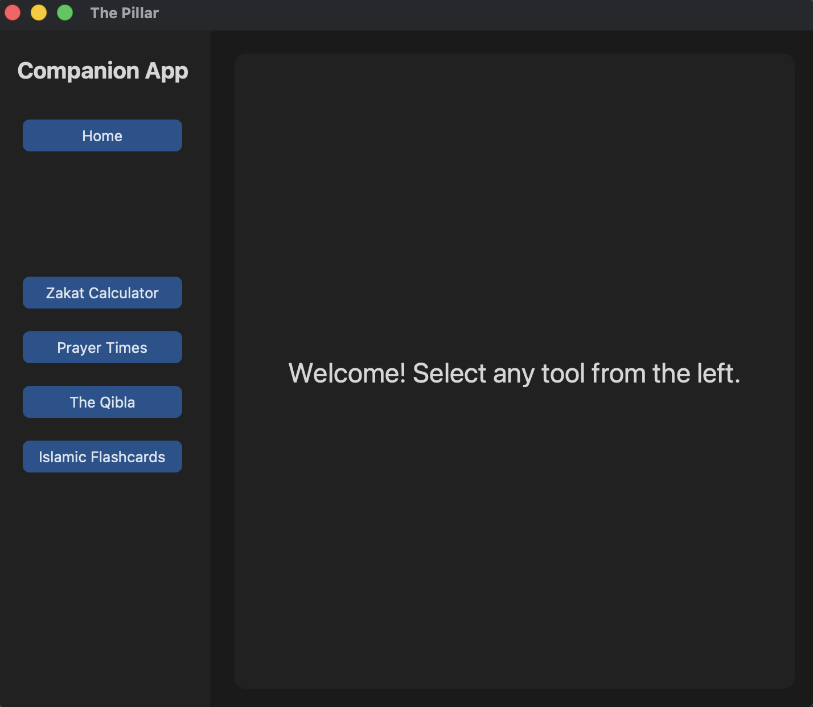
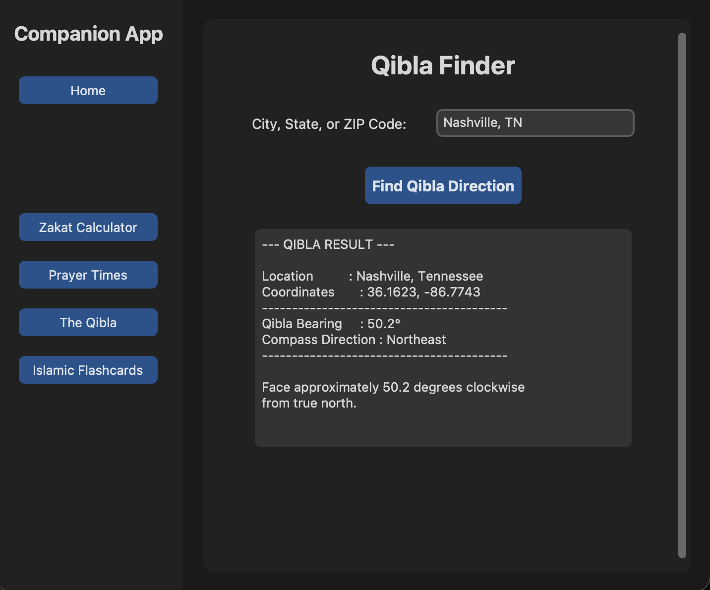
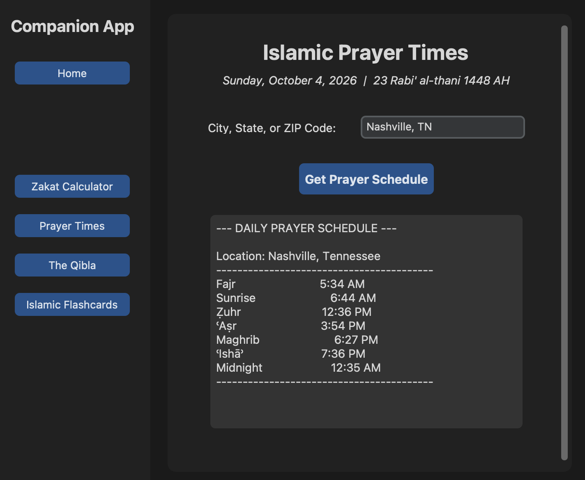
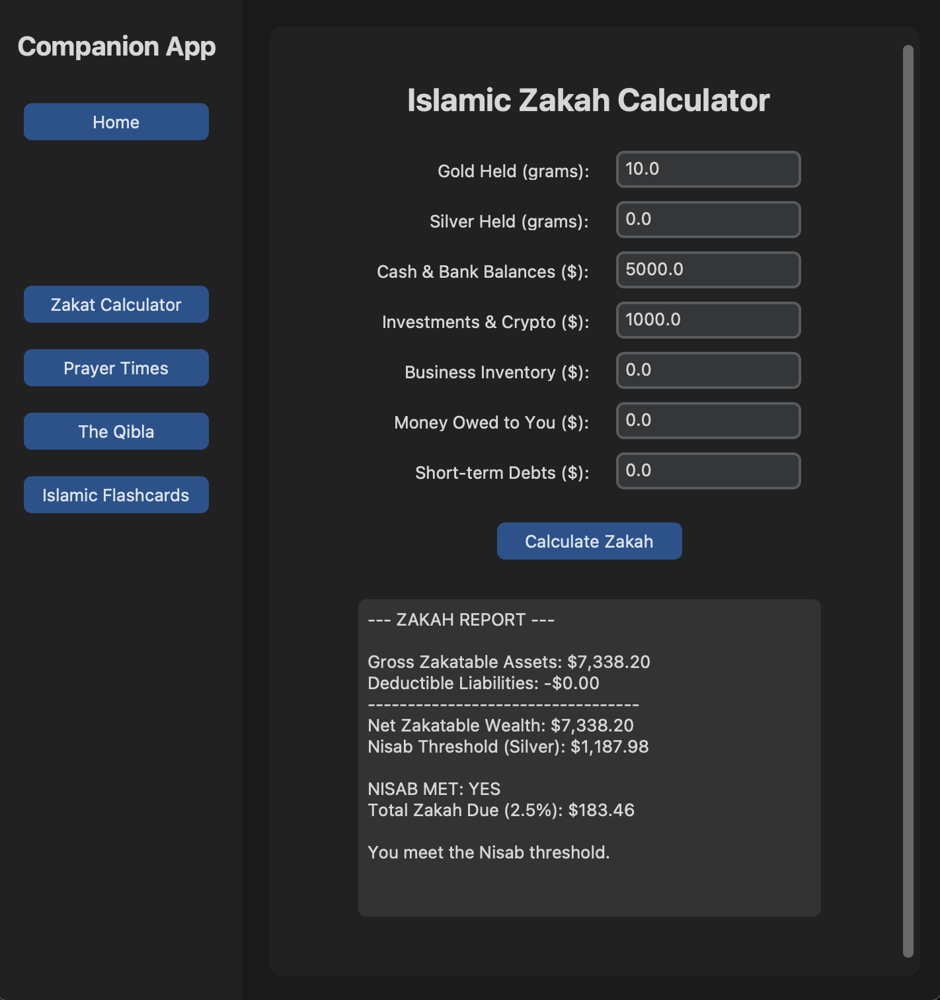

# The Pillar Islamic Companion

The Pillar is a Python desktop application created as a group project for a High-Level Language / Python course. It combines several Islamic utility features in one CustomTkinter interface, including Qibla direction, prayer times, a Zakah calculator, and interactive flashcards.

## Application Preview



## My Contribution: Qibla Finder

My primary contribution was the **Qibla Finder**. I developed the Qibla backend and helped build its CustomTkinter interface.

My work included:

- Converting a city/state or ZIP code into coordinates with `geopy` and Nominatim
- Validating latitude and longitude values
- Calculating the initial great-circle bearing from the user's location to the Kaaba in Makkah
- Converting the numeric bearing into a compass direction
- Handling invalid input and geocoding errors
- Connecting the backend Qibla logic to the GUI and displaying the result

### Qibla Finder Demo

The example below uses Nashville, Tennessee and returns the calculated bearing and compass direction toward the Kaaba.



## Features

### Qibla Finder

Enter a U.S. city/state or ZIP code to calculate the approximate Qibla bearing and compass direction toward the Kaaba.

### Prayer Times

Looks up a location, calculates daily prayer times, and displays both Gregorian and Hijri dates.



### Zakah Calculator

Calculates zakatable wealth using cash, investments, business inventory, receivables, gold, silver, and short-term liabilities. The module attempts to retrieve current gold and silver market prices and falls back to stored estimates if the request fails.



### Islamic Flashcards

Provides question-and-answer flashcards with previous, next, and flip controls.

## Technologies

- Python 3
- CustomTkinter
- geopy / Nominatim
- hijridate
- islamic_times
- JSON
- urllib
- Python `math` module

## Project Structure

```text
the-pillar-islamic-companion/
├── main.py
├── requirements.txt
├── app_sections/
│   ├── __init__.py
│   ├── qibla.py
│   ├── prayer_schedule.py
│   ├── zakat_calculator.py
│   └── flashcards.py
├── views/
│   ├── __init__.py
│   ├── home_ui.py
│   ├── qibla_ui.py
│   ├── prayer_ui.py
│   ├── zakat_ui.py
│   └── flashcards_ui.py
└── data/
    └── flashcards.json
```

## Installation

Clone the repository:

```bash
git clone https://github.com/jmaltech/the-pillar-islamic-companion.git
cd the-pillar-islamic-companion
```

Install the Python dependencies:

```bash
python3 -m pip install -r requirements.txt
```

Run the application:

```bash
python3 main.py
```

## How the Qibla Calculation Works

The Qibla module stores approximate Kaaba coordinates at latitude `21.4225` and longitude `39.8262`. After geocoding the user's location, it converts the coordinates to radians and uses the initial great-circle bearing formula to calculate the clockwise direction from true north.

The resulting angle is normalized to a value between 0 and 360 degrees and mapped to one of eight compass directions.

## Group Project Note

This repository contains work completed as part of a group course project. The Qibla Finder backend and part of the Qibla GUI were my contribution. Other application sections were developed collaboratively or by other group members, as indicated in the source files where attribution was available.

The original flashcard JSON data file was unavailable when this portfolio copy was assembled. A small replacement starter deck is included so the flashcard feature remains runnable. It is not presented as the original group's flashcard dataset.

## Notes

- Location-based features require an internet connection for geocoding.
- Market-price retrieval in the Zakah module depends on an external endpoint and includes offline fallback values.
- Qibla results are intended as a practical directional estimate based on the supplied coordinates.
- The Zakah calculator is an educational software feature and is not a substitute for individualized religious guidance.

## Author

**Jamaal Abdi**

Computer Science student and contributor to the Qibla Finder feature.
